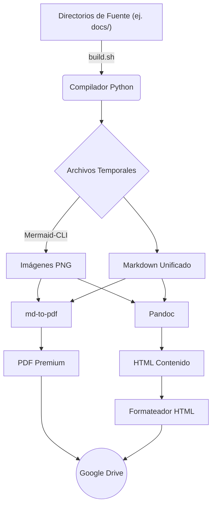

# 1. Arquitectura de PanDocquiles

PanDocquiles está diseñado con un enfoque modular y escalable. Cada herramienta dentro del sistema tiene una responsabilidad única y bien definida, lo que facilita su mantenimiento y extensión.

> [!NOTE]
> Todo el proceso se orquesta mediante Bash, pero el trabajo pesado de ensamblaje, formato y subida se delega a módulos independientes en Python.

## Flujo de Trabajo (Diagrama)

El siguiente diagrama muestra cómo interactúan las distintas piezas del sistema cuando compilas tu documentación:

## Módulos Principales

### 1. El Orquestador (`bin/build.sh`)
Es el punto de entrada del sistema. Su función es leer las opciones CLI o de entorno, llamar a las dependencias externas (como Pandoc o Mermaid-CLI) y coordinar la ejecución secuencial de los módulos de Python.

### 2. Ensamblador (`src/python/compiler.py`)
Módulo encargado de:
- Unir secuencialmente todos los archivos Markdown del directorio (comenzando por `README.md` y concatenando los capítulos numerados `01-*.md`, `02-*.md`, etc.).
- Generar una portada oficial utilizando las variables de entorno.
- Ajustar automáticamente las rutas relativas de las imágenes e hipervínculos internos.
- Generar el `pdf_config.json` necesario para `md-to-pdf`.

### 3. Formateador HTML (`src/python/html_formatter.py`)
Dado que Pandoc genera archivos HTML con imágenes incrustadas en Base64, este módulo interviene el HTML final para:
- Detectar imágenes que excedan los 650px de ancho y limitar su tamaño (para que no rompan la vista previa en Google Docs).
- Formatear y centrar los `<figcaption>` para darles un estilo de leyenda elegante.

### 4. Sincronizador a la Nube (`src/python/uploader.py`)
Módulo independiente que se ejecuta al final del proceso de construcción. Escanea el directorio de salida (definido por `OUTPUT_DIR`, por defecto `documentacion/`), recolecta los archivos `.pdf` y `.html` recién generados, los codifica y los envía mediante un POST request al webhook configurado.

### 5. El Webhook (`src/webhooks/drive_webhook.js`)
Código de Google Apps Script. Es el receptor de la nube. Toma el archivo enviado por `uploader.py`, verifica si ya existe un documento con ese nombre en Drive y, si es así, lo actualiza para no romper las URLs existentes.

### 6. Sistema de Estilos y Plantillas (`config/`)
Contiene las reglas visuales y recursos de diseño:
- `config/css/`: Hojas de estilo inyectadas durante la compilación (`theme-pdf.css` y `theme-gdocs.css`).
- `config/templates/`: Documentos y plantillas de referencia (ej. `.docx`).
