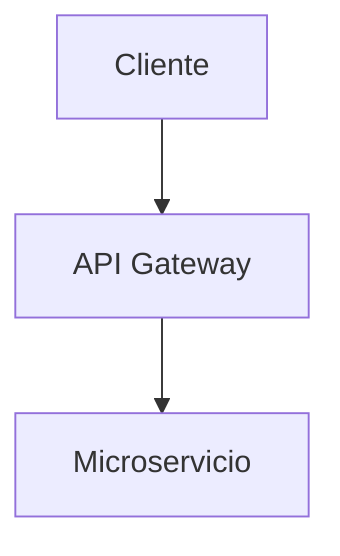

# 3. Guía de Uso y Estructuración

PanDocquiles procesa cualquier directorio de documentación que contenga archivos en formato Markdown (por defecto el directorio `docs/`).

---

## 1. Organización del Contenido

### Estructura Recomendada de un Proyecto de Documentación:

```text
mi-proyecto/
├── docs/                      <-- Directorio de fuente por defecto
│   ├── README.md              <-- (Opcional) Define el título y subtítulo de la portada
│   ├── 01-introduccion.md     <-- Capítulos ordenados numéricamente
│   ├── 02-arquitectura.md
│   ├── 03-api.md
│   └── assets/                <-- Imágenes y recursos locales
│       └── diagrama.png
```

### Reglas de Nomenclatura Interna:
- **`README.md`**: Si existe un título `# Título — Subtítulo` en la primera línea del `README.md`, el compilador lo extrae automáticamente para construir la portada oficial.
- **Capítulos (`01-*.md`, `02-*.md`, `10-*.md`, etc.)**: Se leen y concatenan secuencialmente en orden numérico natural.

---

## 2. Componentes y Sintaxis Especial

PanDocquiles incluye soporte integrado para componentes avanzados de Markdown:

### 💡 Alertas estilo GitHub (Admonitions)
Las llamadas de atención se traducen automáticamente en bloques destacados con formato para impresión:

```markdown
> [!NOTE]
> Información general o contexto sobre la configuración.

> [!IMPORTANT]
> Requisitos clave o instrucciones esenciales.

> [!WARNING]
> Advertencias sobre cambios drásticos o posibles fallos.

> [!TIP]
> Consejos de optimización y mejores prácticas.
```

### 📊 Diagramas de Flujo y Arquitectura (Mermaid)
Puedes incluir diagramas Mermaid directamente en tu código Markdown. El orquestador los renderiza como imágenes PNG de alta resolución antes de compilar a PDF y HTML:

````markdown

````

---

## 3. Ejecución del Comando de Compilación

### Compilar la documentación por defecto (`docs/`):
```bash
./bin/build.sh
```

### Compilar directorios personalizados:
Puedes pasar como argumentos uno o múltiples directorios de origen:

```bash
./bin/build.sh ruta/a/mi-documentacion otra/ruta/guia
```

### 📁 Ubicación de los Resultados
Todos los archivos `.pdf` y `.html` generados se depositan automáticamente en el directorio de salida (por defecto `documentacion/`) y, si está configurado el webhook, se sincronizan con Google Drive.
